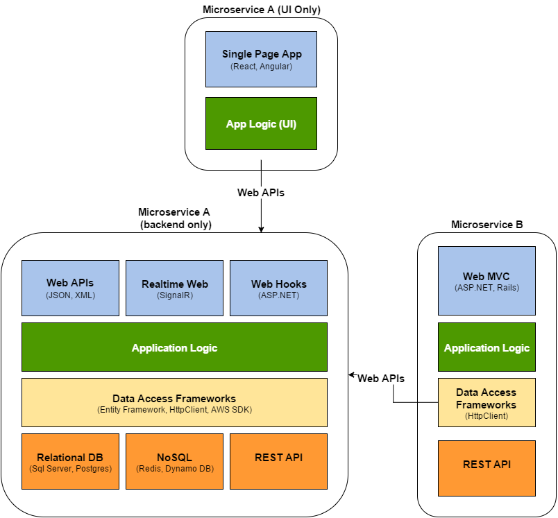

# Architecture
The two prominent Architectures for Web Applications are **Monolithic** and **Service Oriented**.
 
## Monolithic Architecture
Monolithic architecture describes an Application that contains all the components in a single program on a single platform. Internally Monolithic Applications contain separate components. Below is an example of the components in a Monolithic application.

**Pros**

**Cons**

## Service Oriented Architecture (Microservices)
Service oriented Architecture or Microservices are provide services to other components. Each service is an independent system that make up a larger Application.

## Application Architecture 
### Persistance Layer