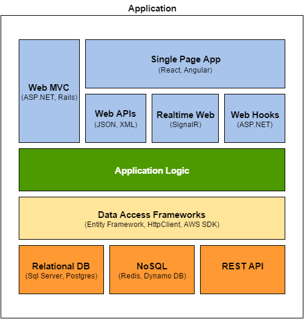

# Architecture
The two prominent Architectures for Web Applications are **Monolithic** and **Service Oriented**.
 
## Monolithic Architecture
Monolithic architecture describes an Application that contains all the components in a single program.

## Service Oriented Architecture

## Application Architecture 
### Persistance Layer